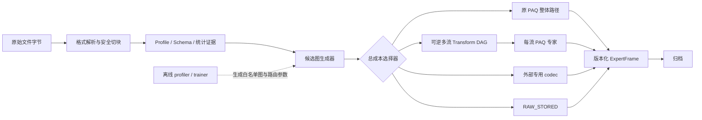

# PAQ 与领域专家压缩聚合：旧稿（已被修正版取代）

> **状态：已废止。** 本稿中的“完整候选双编码/外部 codec 硬路由”不符合用户后来明确的目标。当前有效设计是 `../hierarchical-specialist-router-20260831/CORRECTED_ROUTER_DESIGN.md`：学习领先 codec 的可逆表示与概率模型，融合进同一 PAQ mixer/算术编码器，并在每层保留残余 DEFAULT。

日期：2026-08-31  
状态：完整设计基线稿；总体 wire/选择保证、SAO、Numeric/Raster 与 byte-LM 契约已通过独立只读复核。本轮没有修改源代码、编译或运行压缩实验。

## 1. 结论

这些思想可以与 PAQ 聚合，而且值得做。但正确方案不是继续给 `DEFAULT` 增加标签，然后仍把数据交给 `ContextModelGeneric`。目标应当是一个分层的 **PAQ Expert Graph**：

1. 先识别文件/容器边界并切出同质数据；
2. 对结构化数据执行可逆的多流拆分，而不是只做整块 byte transpose；
3. 同一字节流内的 PAQ 模型采用概率级软混合；
4. 互斥的完整压缩方案采用块/文件级硬路由；
5. 原 PAQ 路径永远保留为候选，安全模式按真实最终字节数择小；
6. 解码端只执行归档中记录的确定配方，不重新分类或训练选择器。

当前补丁是这个方向的前置脚手架，不是完整聚合实现。它实现了 `RECORD/NUMERIC/WIDE_TEXT` 分类和若干可逆变换，但这些类型仍主要落入 `ContextModelGeneric`；没有多流字段图、专用 Numeric/Record/WideText 模型、真实 PAQ 成本选择器、外部 codec 注册表或神经文本专家。因此 `sao` 只获得 RecordModel 预热收益，而 `x-ray` 被低阶代理误选后退化，是现有架构的必然结果。

现有 32 KiB Silesia 验证提供了直接证据：24/24 round-trip 通过，说明可逆性成立；但派生版总计比原版大 619 B，扣除每文件新 magic 后仍大 595 B。归一化后 `sao` 只小 22 B，而 `x-ray` 单文件大 620 B；`NUMERIC/WIDE_TEXT` 没有触发。现有结果记录在 `verification/silesia/EXP01-paq8pxsd-v217-32KiB/RESULTS.md`。

## 2. 先区分两种“无损”

### 2.1 内容无损 / 字节无损

本项目的目标必须是 **原文件逐字节恢复**：

`decode(archive(input)) == input`

每个变换都必须有严格逆变换；容器头、字段顺序、padding、未知扩展和尾随数据都必须保留。

“图像像素相同”“视频帧相同”或“音频采样相同”不等于原文件字节相同。把 PNG 解码成像素再编码成 WebP、把 H.264 解码后编码为 FFV1、把 FLAC 解码后重新编码，都通常不能恢复原来的 PNG/H.264/FLAC 比特流。

### 2.2 压缩率不退化

可逆变换只能保证内容无损，不能保证压缩结果不比原 PAQ 大。若要求相对原 PAQ 严格不退化，唯一可靠判据是比较完整候选的真实输出：

`cost(g) = frame_header + recipe + stream_headers + payloads + required_model_side_info`

`chosen = argmin(cost(LegacyArtifact), cost(candidate_1), ..., cost(RAW_STORED_graph))`

低阶熵、相关系数、stride 分数、甚至 OpenZL 的 StoreOnExpansion 都不能保证相对 PAQ DEFAULT 不退化。StoreOnExpansion 只能阻止结果大于原始未压缩数据，而 `x-ray` 的错误候选虽然比 PAQ 差，仍远小于 32 KiB，因此不会被它挡住。

## 3. 总体架构



这套架构有两个互补的聚合层：

- **软聚合**：多个模型对同一下一 bit 给出概率，交给 PAQ mixer 自适应加权。文本模型、LSTM/byte-LM、RecordModel、MatchModel、NumericModel 属于这一层。
- **硬聚合**：不同候选会产生不同字节表示或不同熵码流，只能选择其中一个。AoS→SoA、数值变换、JPEG XL、FFV1、FLAC、OpenZL 子流属于这一层。

完整外部 codec 不能作为 PAQ mixer 的一个概率输入；同样，PAQ 的一个概率模型也不应被包装成独立子 codec。两层必须分清。

## 4. 五层数据面

### L0：解析与切块

职责：确定哪些字节属于哪个逻辑区域，并保证所有输入字节恰好覆盖一次。

证据优先级：

1. 文件魔数、版本、长度、checksum 和格式语法可完整验证；
2. 用户或数据集提供的 schema/profile；
3. 已知容器中的成员类型；
4. 统计推断出的候选结构；
5. 无可靠证据时保持 DEFAULT。

解析器只负责产生边界和元数据，不直接决定“压缩一定更好”。未知字段、损坏格式、长度溢出、非标准尾部或资源上限超出时，整段回退为原始字节。

### L1：Profile 与候选生成

`ProfileRegistry` 将可靠结构映射成一小组候选图：

- 已知 profile：SAO、DBF、TAR、WAV/AIFF、BMP/raw raster、JPEG、PE/ELF 等；
- schema profile：用户提供的 record/array/field 描述；
- inferred profile：固定 stride、元素宽度、端序、可能行宽等统计推断；
- generic profile：原 PAQ 检测和模型路径。

候选生成器必须是白名单式的。它不能根据一个分数任意拼出复杂图；每个候选图都应有固定 ID、版本、逆变换、资源上限和测试契约。

### L2：可逆 Transform DAG

图节点分四类：

- **Split/Join**：header/body、record field、channel、plane、length/value、alphabet/index；
- **Typed transform**：整数 delta、delta-of-delta、zigzag、frame-of-reference、float XOR、byte shuffle、bitshuffle；
- **Domain transform**：Paeth/median residual、integer color transform、subtract-green、mid-side、fixed/LPC residual；
- **Identity/Store**：保留未知数据、尾部、padding 和无法获益的流。

每个节点必须满足：

- 对所有允许输入定义确定的逆变换；
- 明确端序、整数宽度、溢出语义、首元素/首行处理和尾部处理；
- 参数以规范化字节序列写入 recipe，不直接序列化 C++ struct；
- 先验证长度与资源上限，再分配内存；
- 失败只发生在编码端并回退，解码端不猜测另一条路径。

### L3：后端

#### PAQ 原生后端

- `LEGACY_V216_ARCHIVE`：原始 paq8px 完整 artifact，只存在于顶层 union，作为质量锚点；它不是 StreamFrame backend；
- `PAQ_GENERIC`：Generic 模型集合；
- `PAQ_TEXT`：Text/Word/XML/Nest/LSTM 等；
- `PAQ_RECORD`：record position、field ID、上一记录同字段、跨记录 residual；
- `PAQ_NUMERIC`：元素宽度、bit/lane、前值、前两值、行位置、残差 magnitude/sign；
- `PAQ_RASTER`：完整 8/16/32-bit sample、二维邻域、通道和行宽；
- `PAQ_AUDIO`：采样宽度、声道、sample position、同声道历史和残差；
- `RAW_STORED`：payload 直接保存原 leaf bytes；若以后需要“固定 1/2 概率的 PAQ 子码流”，必须使用另一个 backend ID，不能与 raw wire format 混用。

#### 外部子 codec 后端

外部 bitstream 必须作为独立 payload 直接封装，不再送入 PAQ 做二次熵编码。首批只考虑：

- `JXL_JPEG_RECON`：对 legacy JPEG 做可恢复原 JPEG 比特流的无损重压缩；
- `JXL_RAW` / `WEBP_LOSSLESS_RAW`：只针对能精确分离并重建容器的裸像素区；
- `FLAC_PCM`：只针对精确识别的 PCM 区域；
- `FFV1_RAWVIDEO`：只针对已知 raw frame 序列；
- `OPENZL_GRAPH`：可选的结构化数据子 codec，不作为第一阶段硬依赖；
- `NNCP/TOKEN_LM`：超大文本的可选高成本 profile，后置。

外部 decoder 一旦进入归档格式，就成为长期 ABI。必须固定 codec/profile/version，或静态包含兼容 decoder；不能只记录“使用系统当前版本 libjxl/ffmpeg”。

OpenZL 仍在快速演进。若采用 `OPENZL_GRAPH`，必须锁定经过审计的 release/commit 和 wire-format version，并把兼容 decoder 作为项目依赖；不能把“未来系统安装的 OpenZL”当作归档可解码性承诺。

### L4：版本化独立 frame

当前格式只有一字节 `BlockType`、32-bit block size 和 32-bit `blockInfo`，不适合描述多流图、模型指纹和外部 payload。新项目使用独立 magic；不继续挤占现有 `blockInfo`。

#### 4.1 顶层语义与无回退边界

压缩器的输入先冻结为 `InputSnapshot`：有序的 `(entry_name_bytes, content_bytes)` 集合。名称是前端提供的原始字节串，wire 层不做 Unicode 归一化；单裸流允许空名称。两个候选只有在 entry 数量、顺序、名称和内容都相同的前提下才可比较。

顶层产物是正式 union：

```text
ArchiveArtifact := LegacyArtifact | ExpertGraphArtifact

LegacyArtifact
  exact original v216 wire bytes produced by the frozen legacy encoder

ExpertGraphArtifact
  ArchiveHeaderV1 + FileFrameV1[entry_count]
```

新 magic 固定为 8 字节 `50 41 51 58 45 47 0D 0A`（`PAQXEG\r\n`）；legacy magic 仍由冻结的 v216 decoder 识别。正式安全模式只使用一个名称：`MAX_SAFE`。它比较已经 finalize 的完整 `ArchiveArtifact`，baseline 锁定原 paq8px v216、相同 level/options 和相同 `InputSnapshot`。若 legacy 胜出，直接提交原 `LegacyArtifact`，不再套新 header。若调用者强制只允许 ExpertGraph 格式，只能承诺相对“legacy payload + ExpertGraph envelope”不退化，不能承诺与原 v216 archive 零字节差。新 binary 可以保留 v217 decode 兼容，但 v217 不属于压缩率锚点。

#### 4.2 Archive、文件与 leaf payload 的唯一 framing

v1 固定“一条输入 entry 对应一个 `FileFrameV1`”；文件内的区域拆分放在 recipe 中，不再用多个 FileFrame 表示同一文件。所有 `u16/u32/u64` 均为 little-endian；`header_length/frame_length/archive_length` 都包含自身所在结构的固定头。固定头如下：

```text
ArchiveHeaderV1                         # fixed part = 64 bytes
  magic[8]                              # PAQXEG\r\n
  major:u16 = 1, minor:u16 = 0
  header_length:u32                     # 64 + manifest_length
  flags:u32                             # bit0 HAS_MANIFEST; others v1 = 0
  registry_version:u32 = 1
  entry_count:u64
  manifest_length:u64
  archive_length:u64                    # whole ExpertGraphArtifact
  checksum_algorithm_id:u16 = 1         # SHA-256
  reserved[14] = 0
  manifest[manifest_length]             # canonical TLV; empty if absent

FileFrameV1                             # fixed part = 108 bytes
  magic[4] = "FEG1"
  frame_version:u16 = 1
  flags:u16 = 0
  header_length:u32                     # 108 + name_length + metadata_length
  frame_length:u64                      # header + recipe + stream area
  entry_id:u64                          # contiguous, starting at 0
  uncompressed_offset:u64               # sum of preceding entry content sizes
  original_file_size:u64
  name_length:u32
  metadata_length:u32
  recipe_length:u64
  leaf_payload_count:u32
  profile_id:u32                        # 0 = generic; stable registry ID
  stream_area_length:u64
  original_sha256[32]                   # covers content_bytes only
  entry_name_bytes[name_length]
  metadata_TLV[metadata_length]
  recipe_bytes[recipe_length]
  StreamFrameV1[leaf_payload_count]

StreamFrameV1                           # fixed part = 64 bytes
  magic[4] = "SEG1"
  frame_version:u16 = 1
  flags:u16 = 0
  header_length:u32                     # 64 + parameter_length
  frame_length:u64                      # header + payload
  leaf_stream_id:u32                    # binds payload to Recipe leaf
  semantic_type:u16                     # hint; never changes inverse semantics
  backend_id:u16
  backend_format_version:u32
  decoded_leaf_length:u64
  parameter_length:u32
  model_ref_id:u32                      # 0 = none; otherwise manifest entry
  payload_length:u64
  payload_crc32c:u32                    # Castagnoli over stored payload bytes
  reserved:u32 = 0
  backend_parameters[parameter_length]
  payload[payload_length]
```

长度恒等式必须全部成立：

- `ArchiveHeader.header_length = 64 + manifest_length`；所有 FileFrame 长度之和再加 header_length 必须等于 `archive_length`；
- `FileFrame.frame_length = header_length + recipe_length + stream_area_length`，且 stream area 中恰有 `leaf_payload_count` 个完整 StreamFrame；
- `FileFrame.recipe_length == RecipeV1Header.recipe_length == recipe parser 实际消费的字节数`，且值至少容纳 Recipe header 与 root descriptor；`original_file_size == RecipeV1Header.source_length`，`leaf_payload_count == RecipeV1Header.leaf_count`；
- `StreamFrame.frame_length = header_length + payload_length`；
- FileFrame 按 `entry_id` 和 `uncompressed_offset` 连续排列，entry 数量必须等于 header 声明；正常 EOF 必须恰好落在 `archive_length`，提前或多余字节均报错；
- 未知 major、未知 mandatory flag、非零 reserved、长度溢出、重叠或超出资源预算均拒绝；minor 版本只能增加由 flags/TLV 明示且旧 decoder 可跳过的 optional 数据；
- `manifest` 的每个 model/profile entry 都有稳定 `model_ref_id`、解析方式（builtin/embedded）、规范模型字节 SHA-256；只有 hash 而没有可获得的兼容 decoder/model 时不得开始解码。

`MAX_SAFE` 的生产 decoder 回读比较完整 `InputSnapshot`，包括 entry 数量、顺序、名称和逐字节内容；不能只比较拼接后的 content。SHA-256/CRC32C 用于后续发现损坏，不代替本次逐字节正确性验证。

#### 4.3 Recipe v1：方向、所有权和 payload 绑定

第一版不开放任意 VM。Recipe 是有所有权约束的 DAG。**编码方向**固定为 root 原字节流 → 按规范拓扑序执行 forward node → leaf；**解码方向**为先用每个 StreamFrame 解出 leaf → 按逆拓扑序执行 node inverse → root，不存在第二个单一 sink。

```text
RecipeV1Header                          # followed by descriptors/nodes
  magic[4] = "RCV1"
  recipe_length:u64
  recipe_version:u16 = 1
  flags:u16 = 0
  root_stream_id:u32 = 0
  source_length:u64
  stream_descriptor_count:u32
  node_count:u32
  leaf_count:u32
  reserved:u32 = 0

StreamDescriptor                       # sorted by stream_id
  stream_id:u32                         # contiguous, starting at 0
  role_flags:u16                        # bit0 ROOT, bit1 LEAF
  semantic_type:u16
  logical_element_width_bits:u16        # 0 = opaque bytes
  endian_id:u16                         # 0 opaque, 1 LE, 2 BE
  expected_byte_length:u64
  producer_node_id:u32                  # NONE = 0xFFFFFFFF
  consumer_node_id:u32                  # NONE = 0xFFFFFFFF

NodeDescriptor                         # canonical topological order
  node_id:u32                           # contiguous, starting at 0
  opcode:u16
  opcode_version:u16
  input_count:u16
  output_count:u16
  parameter_length:u32
  input_stream_ids:u32[input_count]
  output_stream_ids:u32[output_count]
  canonical_parameter_TLV[parameter_length]
```

结构 validator 在分配大块内存前强制以下不变量：

- 恰有一个 ROOT 且 ID 为 0；其 producer 为 `NONE`，长度等于 `source_length`；ROOT 在零节点 identity recipe 中也可以同时是 LEAF；
- 除 ROOT 外每个 stream 恰有一个 producer；除 LEAF 外每个 stream 恰有一个 consumer；LEAF 的 consumer 为 `NONE`；不允许孤立 stream/node 或隐式 fan-out；
- 每个 LEAF 恰好对应一个相同 `leaf_stream_id` 的 StreamFrame，StreamFrame 按 ID 递增；INTERNAL 不允许有 payload，ROOT 仅在同时设置 LEAF（零节点 identity recipe）时允许有 payload；`decoded_leaf_length == expected_byte_length`，且 StreamFrame 的 `semantic_type` 必须等于对应 StreamDescriptor；
- NodeDescriptor 的每个 input/output 必须与对应 StreamDescriptor 的 consumer/producer 双向一致；每条 edge 只出现一次，所有 node 都从 ROOT 可达并能到达至少一个 LEAF；拓扑顺序违反即拒绝；
- 每个 node 是其已接受输入域上可逆的 ordered-tuple 映射；forward 消耗其输入所有权并产生输出，inverse 必须唯一恢复输入；
- 参数 TLV 固定为 `tag:u16, flags:u16, length:u32, value[length]`，按 tag 递增；重复 mandatory tag、非零未知 mandatory flag 或非最短数值表示均拒绝；
- 完成逆图后只能剩 stream 0，长度与 SHA-256 必须匹配；解码端从不重跑 classifier，也不尝试另一份 recipe。

#### 4.4 v1 opcode/backend 注册表

ID 一经发布永不复用；每个 ID 的 `version` 同时冻结 forward、inverse、参数、初态、reset、终止和错误语义。第一轮只允许下表中的节点；dictionary/tokenizer、任意 JOIN 和资源 fan-out 等待新版本。

| opcode | ID | arity | v1 精确定义 |
|---|---:|---:|---|
| `IDENTITY` | `0x0001` | 1→1 | 无参数；输出逐字节等于输入，长度不变；inverse 相同。零节点 root-as-leaf 更省字节。 |
| `SPLIT_PARTITION` | `0x0002` | 1→N | mandatory tag `0x0001` 为 N 个 `(offset:u64,length:u64)`，顺序对应 outputs；区间排序后必须无缝覆盖 `[0,input_length)` 且不重叠；forward 取 slice，inverse 按 offset 放回。 |
| `SPLIT_FIXED_RECORDS` | `0x0003` | 1→F+1+[tail] | tags：`0x0001 header_len:u64`、`0x0002 record_count:u64`、`0x0003 record_width:u32`、`0x0004 field_map[]`、`0x0005 tail_len:u64`。输出依次为 header、按 field_id 排序的 F 个 SoA 字段流；仅当 `tail_len>0` 时再追加 tail output。field map 的 `(field_id:u16,offset:u32,width:u32)` 必须恰好覆盖一条 record。输入长度必须等于 `header_len + record_count*record_width + tail_len`；输出长度分别为 `header_len`、每个字段的 `record_count*field_width`，以及存在时的 `tail_len`；NodeDescriptor 的 output_count 必须精确等于 `F+1+(tail_len>0?1:0)`；inverse 按 offset 重建 AoS。 |
| `BYTE_SHUFFLE` | `0x0010` | 1→1 | mandatory tag `0x0001 element_width_bytes:u16`，值属于 `{2,4,8,16}` 且输入长度可整除；若元素数为 n，`out[k*n+i]=in[i*width+k]`；inverse 为反置换。 |
| `DELTA_MOD` | `0x0011` | 1→1 | mandatory tags `0x0001 element_width_bits:u16`（8/16/32/64）和 `0x0002 endian_id:u8`（1 LE/2 BE）；输入长度必须能被 `width/8` 整除。按无符号 N-bit 元素解释，`y0=x0`，`yi=(xi-x(i-1)) mod 2^N`；inverse 用模加。禁止 signed overflow。 |
| `XOR_PREV` | `0x0012` | 1→1 | 使用与 `DELTA_MOD` 相同的 tags/长度约束；元素仅作 bit pattern，`y0=x0`，`yi=xi XOR x(i-1)`；inverse 逐项 XOR。浮点 NaN、负零和 payload bit 不做规范化。 |
| `PREDICT_2D_MOD` | `0x0013` | 1→1 | mandatory tags：`0x0001 element_width_bits:u16`、`0x0002 endian_id:u8`、`0x0003 interpretation:u8`、`0x0004 complete_element_count:u64`、`0x0005 row_width_elements:u32`、`0x0006 channel_count:u16`、`0x0007 predictor_id:u16`、`0x0008 residual_modulus_bits:u16`；精确长度和逐元素规则见 7.1。 |

v1 backend 注册表：

| backend | ID | payload 契约 |
|---|---:|---|
| `RAW_STORED` | `0x0001` | 参数为空；payload 就是 leaf bytes；`payload_length == decoded_leaf_length`。 |
| `PAQ_V216_PAYLOAD` | `0x0010` | frame-local、固定初态的 v216 PAQ core 子码流；不含 v216 archive 文件名/header。level、model set、EOS/finalize 规则和参考 decoder source hash 写入 backend v1 的独立规范及 golden vectors，未通过该冻结门不得 emit。它与顶层 `LegacyArtifact` 是不同 ID/语义。 |
| `PAQ_TEXT_V1` | `0x0011` | P1；固定 mixer input 顺序与 frame-local reset；未冻结 golden probability/bitstream traces 前不得 emit。 |
| `PAQ_RECORD_V1` | `0x0012` | P1；field ID/element position 来自 StreamDescriptor/parameters。 |
| `PAQ_NUMERIC_V1` | `0x0013` | P1；参数遵循 7.1。 |
| `PAQ_RASTER_V1` | `0x0014` | P1；参数遵循 7.1。 |
| `PAQ_AUDIO_V1` | `0x0015` | P2；未冻结前保留 ID、不 emit。 |
| `JXL_JPEG_RECON` | `0x0100` | P3；只接受能由锁定 libjxl decoder 恢复原 JPEG bitstream 的 profile。 |
| `FLAC_PCM` | `0x0101` | P3；backend 解码结果必须是原 PCM leaf，不负责重建容器。 |
| `FFV1_RAWVIDEO` | `0x0102` | P3；backend 解码结果必须是原 raw-frame leaf。 |
| `OPENZL_GRAPH` | `0x0110` | P3；锁定 commit/release、graph wire version 和兼容 decoder。 |

`PAQ_V216_PAYLOAD` 的独立规范不是文档注释，而是 P0 gate：必须列出参考源码 SHA-256、所有参数默认值、EOS/finalize 字节语义、坏流错误条件，并用空流、1 B、1 KiB 和跨平台 golden bitstreams 锁定。P0 可以先只 emit `RAW_STORED` 并完成 frame/validator；任何尚未冻结的 reserved backend 只能被拒绝，不能按“当前系统库”解释。

所有 `PAQ_*_V1` 共享同一个 emit gate，不能因为已分配 ID 就认为 wire format 已冻结。每个 backend 的独立规范必须逐项固定：

- range coder 初态、每 bit 的 interval 更新、EOS/finalize、truncation/error 行为；
- 所有模型/context 的精确整数公式、hash/table 初值、输入顺序和 bit/byte update 时点；
- mixer 拓扑、slot 顺序、初始权重、learning rate、clamp/stretch/squash 表和更新顺序；
- leaf 开始/结束的 reset，禁止跨 leaf 隐式状态；
- 参数 TLV tag/type/default/error domain；
- 空流、短流、全零、递增值及跨平台的 golden probability trace、decoded bytes 和 payload SHA-256。

`PAQ_RECORD_V1` 还必须冻结 field/element position、上一记录同字段和 residual context；`PAQ_NUMERIC_V1` 必须冻结 element bit position、前值/前二值和 residual class；`PAQ_RASTER_V1` 必须冻结 channel/x/y、left/top/top-left 和行边界；`PAQ_TEXT_V1` 必须包含第 8.2 节的 byte-LM slot/update 契约。在相应独立规范通过 gate 前，这四个 ID 都是 reserved-not-emittable；decoder 遇到它们只能在确知相应 backend version 时解码，否则报 unsupported。

独立 frame 会损失跨 frame 自适应，因此 v1 固定一文件一 frame，文件内区域由图处理。每个 PAQ leaf 都是 frame-local state，从固定初态开始；两个 leaf 不共享隐藏状态。以后若增加 solid state，只能以新 major/version 的显式依赖表示，并接受随机访问和并行能力下降。

## 5. 选择器：解决当前问题的核心

### 5.1 候选成本

候选成本必须包含：

- frame 和 stream header；
- graph/profile 描述；
- transform 参数、palette、字典、schema delta；
- PAQ 模型重置和短流冷启动造成的实际 payload；
- 外部 codec payload；
- 若归档要求自包含，预训练模型或字典的 side information。

仅比较“变换后 H0/H1”或“子流裸 payload”会再次造成错误。

### 5.2 三种运行模式

#### `MAX_SAFE`：真实择小

1. 冻结的原 v216 encoder 将完整 `InputSnapshot` 编成临时 `LegacyArtifact`；
2. 对通过结构验证的少量候选分别编码；
3. 加上各自全部 metadata 后比较；
4. 选择最小者并写入归档。

这是唯一能给出相对原 PAQ **候选有效成本**不退化保证的模式，代价是编码时间和临时空间。解码只执行胜出的路径，不增加多倍成本。

这里有一个必须写清的格式边界：若 baseline payload 被包进新 `FileFrame`，新格式仍多出一个固定 envelope，保证只能写成 `new_size <= legacy_payload + minimal_new_envelope`。若要求最终文件字节数严格不大于原 v216 archive，则 baseline 胜出时必须允许直接输出原 legacy wire format；否则任何新 magic/header 都会破坏“零字节回退”承诺。多文件 solid archive 若要同样保证，还必须把“整个原 solid archive”作为顶层候选，不能只做逐文件择小。

#### `BALANCED`：校准选择 + 保守弃权

- 离线用真实 PAQ 码长建立标签，而不是用 H0/H1 自造标签；
- 运行时使用小型确定分类器预测 regret；
- 只有预测收益超过 metadata、误差上界和安全 margin 才采用；
- 模糊、短块、分布外输入一律 DEFAULT；
- 对高风险变换可在少量样本上用独立 shadow coder 估价。

#### `FAST`：确定 profile

只允许文件格式和 schema 已明确验证的 profile；不做任意结构猜测。适用于稳定生产数据，不用于最大压缩 benchmark。

### 5.3 候选事务协议

真实择小的保证依赖完整事务，而不是读取编码器中途的字节计数：

1. 打开不可变 input snapshot，记录长度；每个候选读取同一 snapshot；
2. 每个候选使用 fresh encoder、fresh model state、独立临时文件和固定资源预算；
3. 编码结束必须 flush/finalize 所有 arithmetic/subcodec stream，写完 footer、recipe 和 checksum；
4. 重新打开临时 artifact，用生产 decoder 解到 discard/compare sink；只有长度相同且逐字节与 input snapshot 相同的候选才有资格参与择小；
5. 候选失败、超时、超内存、磁盘不足、decoder 不支持或 compare 失败时，删除该临时候选并记录原因；baseline 失败则整个操作失败，不允许选择未验证候选掩盖错误；
6. 只比较 finalized artifact 的物理文件长度；相同时优先 legacy，其次更低 decoder 依赖/内存的候选；
7. 胜出 artifact 用同目录原子 rename/replace 提交；提交前不覆盖既有目标，失败时保留原目标不变。

这一回读是 `MAX_SAFE` 的运行时资格门槛，不是用 checksum 猜正确性。checksum 用于之后发现损坏；它不能证明一个错误的可逆变换实现正确。`BALANCED/FAST` 只能使用已经通过 conformance/fuzz/跨平台测试并冻结版本的节点，但仍不能拥有与 `MAX_SAFE` 同等级的逐输入实现保证。

### 5.4 两阶段判定

结构识别和收益判定必须分开：

1. `is_valid_structure(x, profile)`：字节是否确实符合结构；
2. `is_profitable(x, graph, PAQ)`：该结构处理后是否比 PAQ baseline 小。

`x-ray` 具有真实的 16-bit/stride-2 结构，但 `TRANSPOSE_DELTA` 对 PAQ 不盈利。结构检测正确不代表变换选择正确。

## 6. `sao` 的目标实现

OpenZL 公布的完整 SAO 结果为 3,516,649 B。其关键步骤是把 header 与记录分离，再把每条 28-byte record 拆成六个同质字段流，而不是只提示 stride 28。[Meta OpenZL 说明](https://engineering.fb.com/2025/10/06/developer-tools/openzl-open-source-format-aware-compression-framework/)和[官方 SDDL 示例](https://openzl.org/sddl/getting-started/)给出的字段为：

| 字段 | 宽度 | 语义 |
|---|---:|---|
| SRA0 | 8 | Float64LE |
| SDEC0 | 8 | Float64LE |
| ISP | 2 | 2-byte spectral type |
| MAG | 2 | Int16LE |
| XRPM | 4 | Float32LE |
| XDPM | 4 | Float32LE |

### 6.1 冻结两个 Silesia profile，不把前缀冒充完整文件

v1 只启用两个数据集特定 profile；一般 SAO 自动 profile 暂不 emit。两者都要求至少 28 B，且前 28 B 的 7 个 LE int32 精确为 `0,1,258997,0,1,1,28`。这里第三个值声明完整对象有 258,997 条记录，每条 28 B。

`SAO_SILESIA_FULL_V1`（`profile_id=0x00010001`）的接受条件是：

- `extent_kind == FULL_OBJECT`；
- `input_size == 28 + 258997 * 28 == 7,251,944 B`；
- `processed_rows=258997`、`tail_length=0`。

`SAO_SILESIA_PREFIX_V1`（`profile_id=0x00010002`）只在调用者明确提供 `extent_kind=PREFIX_FROM_ZERO`，或冻结的 Silesia prefix benchmark profile 明确启用时接受；不能仅因文件看起来“被截断”就自动假定它是某个外部对象的前缀。规则是：

- `28 <= input_size < 7,251,944`；
- `processed_rows = floor((input_size-28)/28)` 且 `processed_rows <= 258997`；
- `tail_length = (input_size-28) mod 28`；
- recipe 写入实际 `processed_rows` 和 `tail_length`，decoder 只相信 recipe 的本次长度，不从 header 中的完整记录数推导当前 payload；
- 不完整的下一条 record 作为 tail 原样进入 `RAW_STORED`/PAQ raw leaf。

因此 32 KiB 输入严格解释为 `32768 = 28 + 1169*28 + 8`：1,169 条完整记录和 8 B tail，不会拿 258,997 条的完整性条件误判回退。任一固定字段、长度方程或显式 extent 条件失败都回到 generic/legacy 候选。

一般 SAO 变体需要先冻结正式的 header 字段表、版本、`STNUM/MPROP/NMAG` 到 stored width 的映射、可选 XNO/magnitude/proper-motion/radial-velocity/name 出现条件以及合法 suffix；在这份表和 conformance corpus 完成前，`SAO_GENERIC` 只保留 ID，不允许 emit。不能把 Silesia 的 28-byte layout 泛化到其他 SAO。

### 6.2 多流图

```text
SAO bytes
  ├─ header -----------------------------------> PAQ_V216_PAYLOAD or RAW_STORED
  ├─ tail (仅非空时存在) ----------------------> RAW_STORED
  └─ records AoS
       ├─ SRA0 Float64LE -> XOR/byte shuffle --> PAQ_NUMERIC_V1(width=64)
       ├─ SDEC0 Float64LE -> XOR/byte shuffle -> PAQ_NUMERIC_V1(width=64)
       ├─ ISP Bytes2 -> identity/byte shuffle --> PAQ_RECORD_V1/PAQ_V216_PAYLOAD candidates
       ├─ MAG Int16LE -> delta/identity --------> PAQ_NUMERIC_V1(width=16)
       ├─ XRPM Float32LE -> XOR/byte shuffle ---> PAQ_NUMERIC_V1(width=32)
       └─ XDPM Float32LE -> XOR/byte shuffle ---> PAQ_NUMERIC_V1(width=32)
```

图中的 `typed delta`、`XOR` 和 `byte shuffle` 只指 4.4 已注册的 `DELTA_MOD/XOR_PREV/BYTE_SHUFFLE`；`dictionary/tokenizer` 不属于 v1 SAO emit 范围。OpenZL 的论文复现 profile 会针对不同字段选择 FieldLZ、zstd、Huffman 和 tokenizer，其手写 SAO graph 可在[官方 `icde26` 复现分支](https://github.com/facebook/openzl/blob/icde26/cli/utils/compress_profiles.cpp#L25-L98)核对；本设计只借鉴“按语义拆流、每流独立选择”，不声称 v1 复刻其全部后端。[OpenZL graph model](https://arxiv.org/abs/2605.09928)

### 6.3 32 KiB 前缀的成本处理

32 KiB 只有 1,169 条完整 record。六路拆分会产生多个模型冷启动和 header，因此：

- `profile_id` 只用于候选生成、日志和审计，**不能替代 recipe**；v1 每个 FileFrame 始终携带完整 canonical `RecipeV1`，`recipe_length=0` 非法；
- header、六个字段和非空 tail 各自是 leaf，各自对应一个 StreamFrame；v1 不合并 leaf，也不共享 PAQ 隐藏状态；
- v1 的 `profile_id` 永远只是 non-semantic hint；未知值必须忽略。解码正确性只由 inline Recipe 和 backend version 决定；若未来要让 profile 参与语义，必须升新格式版本，不能复用 v1 flags；
- 设置最小 row 数；
- `MAX_SAFE` 对完整 32 KiB artifact 的总字节真实择小。

这样才能回答“小前缀是否值得拆”，而不是拿完整文件的 OpenZL 结果直接外推。

## 7. `x-ray` 与通用数值/栅格设计

`x-ray` 应被理解为 16-bit raster/numeric signal，而不是“stride=2 record”。当前 mode 2 做两个独立 8-bit lane 的 transpose+delta，改善了低阶代理，却破坏了原 PAQ 已利用的 16-bit、lag-2、Match、Record 和 LinearPrediction 关系。

正确候选是：

- 以完整 16-bit element 解码，明确端序；
- 保留或推断行宽后使用 left/top/top-left/linear predictor；
- residual 使用足够宽的 unsigned 定义，避免 C++ signed overflow；
- 可选 byte shuffle/bitshuffle，但它们与“原排列 + PAQ_RASTER”分别作为候选；
- 模型 context 包含 element bit position、channel、x/y、上一 sample、上一行 sample 和 residual class；
- 未知行宽时，至少保留一维完整 element predictor，不做两条独立 8-bit 差分；
- 最终与原 PAQ 真实码长择小。

这也适用于 scientific array、传感器、tensor 和 raw image。Parquet 的 delta/frame-of-reference、dictionary/RLE/bit packing、byte-stream split，以及 Blosc 的 shuffle/bitshuffle，都表明 element type/width 是不可缺失的结构信息。[Parquet encoding spec](https://parquet.apache.org/docs/file-format/data-pages/encodings/)、[Blosc](https://blosc.org/pages/)

### 7.1 Numeric/Raster v1 的逐元素确定语义

`PREDICT_2D_MOD`、`PAQ_NUMERIC_V1` 和 `PAQ_RASTER_V1` 共用规范化参数：

```text
element_width_bits:u16       # 8/16/32/64
endianness:u8                # 1 LE, 2 BE
interpretation:u8            # 0 unsigned bit-pattern, 1 signed-context, 2 IEEE-bit-pattern
complete_element_count:u64
row_width_elements:u32       # 0 = unknown/1-D
channel_count:u16            # >=1; interleaved sample order
predictor_id:u16             # registry below
residual_modulus_bits:u16    # 必须等于 element_width_bits
```

参数的 wire 表示就是 4.4 `PREDICT_2D_MOD` 所列 `0x0001..0x0008` canonical TLV；没有隐式 `shuffle_id`，shuffle 只能由图中另一个显式 `BYTE_SHUFFLE` node 表示。必须满足 `input_length == complete_element_count * (element_width_bits/8)`；不足一个元素的字节在进入该 node 前由 `SPLIT_PARTITION` 分成 raw tail。若 `row_width_elements>0`，还必须满足 `complete_element_count % row_width_elements == 0`、`row_width_elements % channel_count == 0`；若为 0，只允许一维 predictor。

所有元素先按声明端序装入同宽无符号整数 `x∈[0,2^N)`。`signed-context` 只影响 PAQ context，不改变 bit pattern；IEEE float 只允许 bit-cast/XOR，不允许浮点算术、NaN canonicalization 或负零合并。乘法和长度计算先用至少 128-bit/checked arithmetic 验证，再分配。

预测器 ID 和边界条件固定如下：

| predictor | ID | 预测值 `p(i)` |
|---|---:|---|
| `ZERO` | 0 | 始终 0；用于保留原元素 bit pattern 的 residual 表示。 |
| `PREV_1D` | 1 | `i<channel_count` 时 0，否则索引 `i-channel_count` 的前一个同通道元素。 |
| `LEFT` | 2 | 本行当前 channel 没有左邻居时 0，否则索引 `i-channel_count`。 |
| `TOP` | 3 | 第一行 0，否则上一行同列元素。 |
| `GRADIENT_MOD` | 4 | 第一元素 0；第一行用 LEFT；其余每行首元素用 TOP；内部为 `(L + T - TL) mod 2^N`。 |

对 interleaved 多通道，令 `col = i mod row_width_elements`。LEFT/TL 只在 `col >= channel_count` 时存在；TOP 只在 `i >= row_width_elements` 时存在。`GRADIENT_MOD` 的 fallback 精确定义为：L、T 都不存在则 0；只有 L 则 L；只有 T 则 T；两者都存在才用 `(L+T-TL) mod 2^N`。这覆盖每行前 `channel_count` 个元素，而不只是字面上的第一个元素。若行宽为 0，只允许 `ZERO/PREV_1D`。forward 输出 `r(i)=(x(i)-p(i)) mod 2^N`；inverse 按相同扫描顺序用已恢复邻居计算 `x(i)=(r(i)+p(i)) mod 2^N`。`XOR_PREV` 始终作用于原 bit pattern。若图中随后有 `BYTE_SHUFFLE`，拓扑顺序即 residual 后 shuffle；inverse 由逆拓扑自然先 unshuffle 再逆预测。

`x-ray` 的首批候选冻结为 16-bit LE/BE × `PREV_1D`，以及仅在行宽有强证据或显式 schema 时启用的 `GRADIENT_MOD`；原排列 + `PAQ_RASTER_V1`、delta 后 + `PAQ_NUMERIC_V1`、byte-shuffle 后 + `PAQ_NUMERIC_V1` 是三个独立候选，不能由 proxy 一次性绑定。尾数不足一个元素时必须先拆为 raw tail。

### 7.2 未知 `DEFAULT` 的通用二次分析

已知 profile 不能覆盖一般文件，因此 `DEFAULT` 仍需要自动二次分析，但它的职责应从“直接选择变换”改为“产生少量候选描述”。建议流水线：

1. **change-point segmentation**：依据 byte-class、entropy、match behavior、zero density、alignment 和局部周期变化，把一个大 DEFAULT 再切成相对同质区域；
2. **候选族生成**：
   - fixed record stride 2..1024；
   - integer/float width 2/4/8、LE/BE、row width；
   - UTF-16/UTF-32；
   - TLV/length-prefixed streams；
   - sparse/padding/bitmap；
   - raw raster/audio geometry；
3. **字段边界推断**：用不同 offset 的取值基数、同列重复、跨记录 residual、byte significance 和互信息提出 FieldMap，而不只提出一个 stride；
4. **全段一致性检查**：候选必须在首/中/尾窗口和 block remainder 上成立；尾部必须有显式 identity stream；
5. **top-K 截断**：按结构可信度保留少量白名单图，防止组合爆炸；
6. **收益判定**：`MAX_SAFE` 实际编码后择小；其他模式使用由真实 PAQ regret 训练的预测器并保守弃权。

因此“多数一般文件先归 DEFAULT”本身不是问题；问题在于当前 DEFAULT 只有一次粗分类、单输出变换和 Generic 后端。新设计允许 DEFAULT 内再次分段、生成多流图，并让每个子流选择真正不同的 PAQ 专家。

## 8. 文本与神经专家

### 8.1 首选：PAQ 内部 byte-LM 专家

当前 paq8px 已有 TextModel、WordModel 和可选 LSTM。第一版神经增强不应另开一个 Transformer codec，而应增加一个确定性的 byte-level probability expert：

1. 在字节边界产生 `q[256]`；
2. PAQ 编码当前字节各 bit 时，根据已知 MSB prefix 聚合 `q`，得到下一 bit 条件概率；
3. 将概率量化/夹紧到 PAQ 的固定概率域；
4. 作为一路 `Mixer.add(stretch(p))` 输入；
5. 字节完成后，编码和解码双方用相同字节推进模型。

好处：

- 仍使用同一个 PAQ arithmetic coder；
- mixer 能在模型失准时自动降权，不需要硬分类；
- byte 模型不引入 BPE tokenizer 边界和逆 tokenization；
- 可与 Match/Text/Word/XML/LSTM 并行互补。

NNCP 的核心也是“预测下一符号概率，再用算术编码”，在线训练可由两端同步重放，因此不必发送最终权重。[NNCP 论文](https://bellard.org/nncp/nncp.pdf) 但 NNCP/Transformer 在 enwik 上的领先不能直接外推到一般文件；Large Text Compression Benchmark 是单一 Wikipedia XML corpus，并且排名会计入解压程序。[官方 benchmark](https://www.mattmahoney.net/dc/text.html)

### 8.2 确定性契约

第一版只接受输出整数 raw mass `r[256]:u32` 的 `BYTE_LM_EXPERT_V1`；reference integer op graph 必须直接定义这些值，使用饱和到 `[0,2^32-1]` 的语义，不调用平台 softmax。令 `Q=2^24`、`R=Q-256`，规范化唯一规定为：

1. 先令全部 `q[b]=1`；用 `u64` 求 `S=sum(r)`；
2. 若 `S=0`，令 `a=floor(R/256)`、`m=R mod 256`，对每个 b 加 `a + (b<m ? 1 : 0)`；
3. 若 `S>0`，用 `u128` 计算 `z[b]=R*r[b]`，先加 `floor(z[b]/S)`；令 `L=R-sum(floor(z[b]/S))`，再按 `(z[b] mod S)` 降序、byte 值升序打破平局，给前 L 项各加 1；
4. 结果必须逐项 `>=1` 且精确满足 `sum(q)=Q`，否则 backend 报错。

编码一个字节的第 `k` 个 MSB-first bit（`k=0..7`）时，已知 prefix 为 `c`。定义：

```text
S0 = sum(q[b] | top k bits of b == c and bit(7-k,b) == 0)
S1 = sum(q[b] | top k bits of b == c and bit(7-k,b) == 1)
p1 = clamp(1, 4095, floor((4096*S1 + floor((S0+S1)/2)) / (S0+S1)))
```

所有求和和乘法至少使用 `u64`；这是 round-half-up 到 PAQ 12-bit probability domain。`p1` 经冻结的 v216 `stretch` 查表进入固定 `mixer_slot_id`，slot 顺序、context selection、mixer learning-rate/update 顺序都属于 `PAQ_TEXT_V1` backend version。第 8 个 bit 编码并完成 mixer update 后，模型恰好用该完整 byte 更新一次；随后才计算下一份 `q`。frame 开始从 manifest 指定的固定初态 reset，frame 内禁止根据未来字节、线程调度或候选结果改变更新。

归档/manifest 还必须锁定：

- model algorithm ID/version、reference integer op graph、张量 shape/layout；
- 显式初始权重的规范模型字节 SHA-256；v1 禁止只写 seed 的初始化路径，因而不依赖未冻结的 PRNG/draw order；
- saturating/wrapping 规则、累加位宽、shift、除法和每个 rounding point；
- optimizer、learning rate、update/retrain schedule（若在线训练）；
- reset boundary、mixer slot 和 update 时点；
- tokenizer/词表（只有后置 token backend 才允许）及 hash；
- 禁用 dropout、随机采样、fast-math 和非确定 GPU kernel。

规范模型字节本身也固定：tensor 按稳定 `tensor_id:u32` 升序，每项编码 `dtype_id:u16, rank:u16, dims:u32[rank], byte_length:u64, packed_data`；v1 dtype 只允许明确位宽的二进制补码整数，packed data 为 little-endian、row-major、无 padding。model SHA-256 覆盖包含 algorithm/version 和全部 tensor descriptor/data 的 canonical byte sequence。

model hash 只能识别权重，不能替代算法定义。emit gate 的每个 checkpoint 必须保存完整 `q[256]`（1,024 B、每项 u32-LE）或该确切 1,024 B 的 SHA-256，并记录八个 `p1`、mixer 输入/更新值和最终 payload SHA-256；“摘要”不是合格 trace。任一 trace 不一致就禁用该专家并回到其他候选。编码/解码概率只要跨过一个整数 CDF 边界，余下码流就会失步，因此 v1 只用定点/整数模型；若未来使用浮点，需像 LibNC 一样另立 backend version 并证明跨平台复现。[LibNC](https://bellard.org/libnc/)

### 8.3 模型字节如何计费

- v1 model resolution 只允许 `builtin` 或 `embedded`：builtin 在 archive 中写 ID/version/hash，由匹配的 decoder bundle 提供；embedded 的 canonical model bytes 在 manifest 中按 SHA-256 去重并计入 archive wire size；v1 禁止任意外部路径/URL model reference；
- 外部 content-addressed model 若将来需要，必须在 v2 新增明确 resolution mode、离线可获得性和失败语义，不能让 v1 decoder 猜本机文件；
- 每文件 fine-tune：decoder 若不能从已解码前缀完全重放更新，就必须发送 checkpoint/delta；
- NNCP 式在线训练：不发送最终权重，但计算代价高，所有训练语义都属于格式规范。

研究报告同时给出三个不可混用的量：

```text
wire_bytes(A) = finalized artifact 的物理字节数
standalone_bytes(A) = wire_bytes(A)
                    + decoder_without_resources_bytes
                    + sum(size(h), h in unique builtin resources required by A)
amortized_bytes(C) = sum(wire_bytes(A), A in predeclared corpus C)
                   + decoder_without_resources_bytes
                   + sum(size(h), h in union of builtin resources required by C)
amortized_bpb(C) = 8 * amortized_bytes(C) / sum(original_content_bytes(A), A in C)
```

同一 canonical SHA-256 的 program/model/tokenizer resource 在一个公式中只计一次；embedded resource 已在 `wire_bytes` 中，不再重复；corpus C、decoder binary、资源 hash/size 清单必须在运行前声明，不能事后挑分母。`MAX_SAFE` 的逐 archive 不退化承诺只比较 `wire_bytes`，不声称在 standalone/amortized 指标上也一定胜出。

`Language Modeling Is Compression` 明确区分 raw payload 与包含模型参数的 adjusted/two-part code；大模型在 1 GB 数据上也可能无法摊薄。[论文](https://arxiv.org/pdf/2309.10668)

### 8.4 后置外部文本 codec

完整 NNCP/ts_zip 只作为超大文本的 opt-in backend：

- payload 使用自己的 arithmetic coder，直接封装；
- 必须比较 `payload + model dependency + headers` 与 PAQ；
- 解码串行、时间长、模型大；
- 不进入默认通用压缩路径。

## 9. 其他领域的聚合策略

| 输入域 | 优先解析/切块 | PAQ 内部或前变换 | 可选外部 codec | 禁止/回退条件 |
|---|---|---|---|---|
| 固定记录/数据库 | schema、record size、field offsets | AoS→SoA；typed delta、dictionary、field contexts | OpenZL graph 可选 | schema 未验证或短流开销过大 |
| 数值/科学数组 | width、endian、shape、row stride | true element residual、shuffle/bitshuffle、NumericModel | OpenZL/Blosc-like 可选 | 把多字节值当独立 byte lane |
| UTF-8/ASCII 文本 | encoding、language/markup boundaries | Text/Word/XML + byte-LM；可逆 token transform | NNCP/ts_zip 后置 | 小文本、模型成本无法摊薄 |
| UTF-16/32 | BOM/端序/code-unit validity | code-unit model；lane split 与 Text model并列候选 | 通常不需要 | 仅标 WIDE_TEXT 后走 Generic |
| raw/未压缩 BMP/TIFF 像素 | header、width/height/stride/channel | Paeth/median、integer RCT、full-sample raster contexts | JXL/WebP raw payload | 压缩 TIFF strip 或不能精确重建 header/padding/metadata |
| legacy JPEG | JPEG syntax | 保留现有 JPEG model | JPEG XL bitstream reconstruction | 普通 pixel transcode 不能替代 |
| PNG/WebP/JXL 文件 | chunk/box/stream parser | 保留现有精确可逆 filter；结构建模 | 原则上不做任意重编码 | 像素相同不等于原文件相同 |
| raw video / uncompressed AVI | frame table、pixel format、stride | FFV1-style median/RCT/temporal-zero contexts | FFV1 raw frames | 已压 H.264/HEVC/AV1 禁止重编码 |
| PCM WAV/AIFF | RIFF/FORM chunks、sample format | mid-side、fixed/LPC residual、AudioModel | FLAC PCM | 非音频 chunks/padding/order未保存 |
| 已压音频 | frame/container parser | 轻量 header contexts 或 `RAW_STORED` | 通常不重编码 | FLAC/MP3/AAC bitstream不可复原 |
| TAR | 512-byte headers、member size/padding | header model；成员递归检测；可选同类 solid grouping | 不需要 | 非标准/损坏格式整段回退 |
| ZIP/PDF/Office | object/chunk/deflate 边界 | 现有 zlib 等精确可逆重压缩 | 后置 | 解包后重新打包不能保证原字节 |
| PE/ELF/Mach-O | section/relocation/import boundaries | E8/E9、code/data 分模、section contexts | 通常不需要 | 未知/加密/packed section 回退 |
| 已压缩/加密/随机 | magic + compressibility guard | `RAW_STORED` 或 legacy PAQ | 无 | 不做高成本模型和二次压缩 |

### 9.1 图像

WebP lossless 的 predictor、color、subtract-green 和 color indexing 说明空间/颜色可逆变换有效，但这些工具应优先转化为 PAQ 前变换或 context，而不是搬入完整 WebP entropy layer。[WebP lossless specification](https://developers.google.com/speed/webp/docs/webp_lossless_bitstream_specification)

JPEG XL 明确支持 lossless coding 和 legacy JPEG lossless recompression；后者能重建原 JPEG bitstream，是外部媒体 codec 中最适合优先接入的一项。[JPEG XL 官方说明](https://jpeg.org/jpegxl/index.html)、[libjxl](https://github.com/libjxl/libjxl)

### 9.2 视频

FFV1 的 median predictor、局部 context、独立 slice 和 CRC 可用于 raw video 模型或前变换。[RFC 9043](https://www.rfc-editor.org/rfc/rfc9043.html) 但对已有 H.264/HEVC/AV1 文件，decode→FFV1 只能保证帧内容，不保证原 bitstream，默认应 `RAW_STORED`/generic/legacy。

### 9.3 音频

FLAC 的 channel decorrelation、fixed/LPC predictor 和 residual 思路适合复用到 PAQ AudioModel；Rice entropy coding若使用 PAQ后端则不重复实现。[RFC 9639](https://www.rfc-editor.org/rfc/rfc9639.html) 外部 FLAC 只处理被精确定位的 PCM，并保留 WAVE/AIFF 其他 chunk。

### 9.4 TAR

TAR 是容器，不是一个专用熵 codec。GNU tar 规范中，每个 member 是 512-byte header 加 payload/padding，归档末尾通常有两个全零块。[GNU tar format](https://www.gnu.org/software/tar/manual/html_section/Standard.html) 当前 paq8px 已有 `TAR/TARHDR` 和成员递归逻辑，这是正确基础；后续应补全 pax/GNU long name/sparse/base-256 等保守解析，而不是 extract 到文件系统再重打包。

## 10. 归档兼容与安全

### 10.1 新项目与兼容策略

建议新建独立项目，例如 `paq8px-expertgraph-v1`：

- 原 `paq8px-master` 保持完全不动；
- 当前 `structured-default-v2` 作为研究分支保留；
- 新 binary 可以提供 legacy v216/v217 decode；
- 新 ExpertGraph archive 使用全新 magic/version；
- 旧 binary 不承诺解码新格式。

不要把新格式伪装成 v216，也不要继续用 32-bit `blockInfo` 塞入多流 recipe。

### 10.2 资源与攻击面

- 对 `original_length`、`payload_length`、stream count、graph node count、dimension multiplication 设硬上限；
- 使用 checked arithmetic，禁止 signed overflow；
- parser 不访问文件系统、不跟随 TAR symlink/hardlink；
- 外部 decoder 在受限内存和输出长度内运行；
- graph 禁止循环，拓扑和每个输入/输出连接在解码前验证；
- checksum 用于完整性检测，但不能替代边界检查；
- unsupported codec/model 给出明确错误，不从网络自动下载依赖。

## 11. 对当前代码的具体映射

当前可复用基础：

- `src/filter/Filters.hpp`：已有格式检测、递归变换、TAR 成员分块；
- `src/model/ContextModel.cpp`：已有按 BlockType 路由模型；
- `src/model/ContextModelText.cpp` 和 LSTM 容器：可承接 byte-LM expert；
- `src/model/ContextModelImage*.cpp`、`ContextModelAudio*.cpp`：可增强域 context；
- `src/Block.*`：现有 block header 编码；
- `src/filter/StructuredDataFilter.hpp`：已有少量可逆变换和 metadata 验证。

当前必须替换/扩展的边界：

- `DefaultStructureDetector.hpp` 不能再承担收益保证，只能输出结构候选；
- `RECORD/NUMERIC/WIDE_TEXT` 必须在 `ContextModel.cpp` 有专用路由，不能继续全部落入 Generic；
- `StructuredDataFilter` 需要从单输入单输出升级到多流 graph；
- `BlockType + blockInfo` 不能承载新 recipe；
- 外部 codec payload 需要独立 frame，不应通过 `predictorMain` 二次编码；
- selector 需要实际总成本接口和 baseline candidate。

建议未来新增模块（仅设计，尚未创建）：

```text
src/expertgraph/
  ArchiveFrame.{hpp,cpp}
  RecipeCodec.{hpp,cpp}
  TransformGraph.{hpp,cpp}
  StreamDescriptor.{hpp,cpp}
  ExpertRegistry.{hpp,cpp}

src/router/
  ProfileRegistry.{hpp,cpp}
  CandidateGenerator.{hpp,cpp}
  CostSelector.{hpp,cpp}
  RegretModel.{hpp,cpp}

src/profile/
  SaoProfile.{hpp,cpp}
  RecordSchemaProfile.{hpp,cpp}
  NumericArrayProfile.{hpp,cpp}
  RawRasterProfile.{hpp,cpp}
  PcmProfile.{hpp,cpp}

src/model/
  ContextModelRecord.cpp
  ContextModelNumeric.cpp
  ContextModelWideText.cpp
  ByteLmExpert.{hpp,cpp}

src/external/
  JxlExpert.{hpp,cpp}
  FlacExpert.{hpp,cpp}
  Ffv1Expert.{hpp,cpp}
  OpenZlExpert.{hpp,cpp}
```

## 12. 实施顺序

### P0：先建立不会再误选的骨架

1. 冻结新 archive/frame/recipe 格式；
2. 冻结 `PAQ_V216_PAYLOAD` 子码流，并把 `LEGACY_V216_ARCHIVE` 保持为独立顶层候选；
3. 实现真实总成本选择器和 `MAX_SAFE` 模式；
4. 将当前 detector 改成只生成候选，不直接放行；
5. 增加每候选实际字节、metadata、选择 regret 的可审计日志；
6. 暂不接任何外部 codec。

完成标准：冻结的 legacy encoder 生成完整可比较的 `LegacyArtifact`；`MAX_SAFE` 比较的是 finalize 后的整个 archive，而不是 payload 计数；每个候选经生产 decoder 对 entry 名称与内容逐字节回读后才有资格被提交；临时文件/磁盘错误不会覆盖已有目标；任何新候选失败均能安全回退；解码端不运行 classifier。

### P1：兑现 `sao`、`x-ray` 和文本三个核心路径

1. 实现多流 Transform DAG；
2. 实现严格 SAO profile 和六字段拆流；
3. 实现真正的 `ContextModelRecord/ContextModelNumeric`；
4. 将 16-bit raster 从 RECORD 路由中分离；
5. 让 WIDE_TEXT 进入文本/码元专用模型；
6. 加入小型确定 byte-LM expert，由 PAQ mixer 软混合。

完成标准：所有选择按真实总字节；`x-ray` 不可能因 proxy 误选而劣于 baseline；SAO 的收益来自字段拆流且可以逐字段归因。

### P2：扩展原生域模型和容器

1. raw image 的 Paeth/median/RCT 与 16-bit sample contexts；
2. PCM 的 mid-side/fixed predictor 和 AudioModel；
3. TAR/pax/GNU 解析完备化；
4. PE/ELF section-aware model；
5. known schema registry：DBF、Protobuf、Parquet-like、custom record。

### P3：有限接入外部 codec

顺序建议：

1. JPEG XL legacy JPEG reconstruction；
2. FLAC PCM；
3. JXL/WebP raw image payload；
4. FFV1 raw video；
5. OpenZL graph 作为可选结构化 backend。

每个外部 codec 都必须是可关闭的 build/profile，并通过相同真实择小接口；不进入默认路径直到 decoder ABI、许可、安全和长期维护策略明确。

### P4：更强训练与自动结构发现

- 用代表性训练集离线产生 Pareto graph；
- 用实际 PAQ cost 训练轻量 regret predictor；
- 自动 field-boundary/width/schema inference 只生成候选，不绕过 baseline；
- 超大文本可探索 NNCP/Transformer 外部 backend；
- 研究 solid grouping、随机访问与跨文件共享模型的权衡。

## 13. 将来实施后的验证规范

本轮不执行这些实验；以下是代码完成后必须满足的验收协议。

### 正确性

- 每个 transform 的 property/fuzz round-trip；
- 每个 frame 原始 length 与 checksum 一致；
- legacy/new archive 跨版本 decode matrix；
- 外部 codec 逐字节恢复原文件，而不只比较像素/帧/采样；
- parser 面对截断、恶意长度、未知扩展时回退或报错。

### 压缩率

- 每个文件报告 baseline bytes、candidate bytes、metadata、chosen bytes；
- 报告 coverage、precision、false-positive regret 和总 regret；
- prefix 32/64/128 KiB 与完整文件分开；
- Silesia 逐文件和总和都报告，不只展示赢家；
- learned codec 同时报告 payload-only、model/program size 和 amortized total。

### 性能

- encode/decode time、peak RAM、temporary disk；
- `MAX_SAFE` 的多候选编码开销单独报告；
- small-block 冷启动与 graph header 开销；
- 外部 decoder 初始化和模型加载成本。

## 14. 最终推荐

推荐采用“**PAQ 为核心后端，OpenZL 为架构参考，外部 codec 为受控插件**”的路线：

- `sao` 首先用 schema-aware AoS→SoA + 每字段 PAQ 专家解决；
- `x-ray` 用完整 16-bit raster/numeric model 解决；
- 文本首先加 PAQ 内部 byte-LM 概率专家，而不是先嵌入大 Transformer；
- TAR 做容器递归；图像/视频/音频先加强 PAQ model 和短小可逆变换；
- JPEG XL 的 JPEG bitstream reconstruction 是最优先外部 codec；
- 原 PAQ 完整路径始终是候选，`MAX_SAFE` 按 finalized 整体 artifact 真实择小。

这既保留了 PAQ 的核心优势，又真正吸收了结构化、神经和媒体专用压缩的有效部分；同时避免把项目变成一个只会按扩展名调用第三方程序的外壳。

## 15. 一手来源

- [OpenZL: A Graph-Based Model for Compression](https://arxiv.org/abs/2510.03203)
- [OpenZL: Using Graphs to Compress Smaller and Faster](https://arxiv.org/abs/2605.09928)
- [OpenZL concepts](https://openzl.org/getting-started/concepts/)
- [Meta OpenZL SAO example](https://engineering.fb.com/2025/10/06/developer-tools/openzl-open-source-format-aware-compression-framework/)
- [OpenZL SDDL SAO description](https://openzl.org/sddl/getting-started/)
- [OpenZL reproducible SAO graph](https://github.com/facebook/openzl/blob/icde26/cli/utils/compress_profiles.cpp#L25-L98)
- [NNCP lossless compression with neural networks](https://bellard.org/nncp/nncp.pdf)
- [NNCP v2 Transformer](https://bellard.org/nncp/nncp_v2.pdf)
- [Large Text Compression Benchmark](https://www.mattmahoney.net/dc/text.html)
- [Language Modeling Is Compression](https://arxiv.org/pdf/2309.10668)
- [CMIX official repository](https://github.com/byronknoll/cmix)
- [Parquet encodings](https://parquet.apache.org/docs/file-format/data-pages/encodings/)
- [WebP lossless bitstream](https://developers.google.com/speed/webp/docs/webp_lossless_bitstream_specification)
- [JPEG XL official overview](https://jpeg.org/jpegxl/index.html)
- [FFV1, RFC 9043](https://www.rfc-editor.org/rfc/rfc9043.html)
- [FLAC, RFC 9639](https://www.rfc-editor.org/rfc/rfc9639.html)
- [GNU TAR basic format](https://www.gnu.org/software/tar/manual/html_section/Standard.html)
- [The ZPAQ Compression Algorithm](https://mattmahoney.net/dc/zpaq_compression.pdf)
